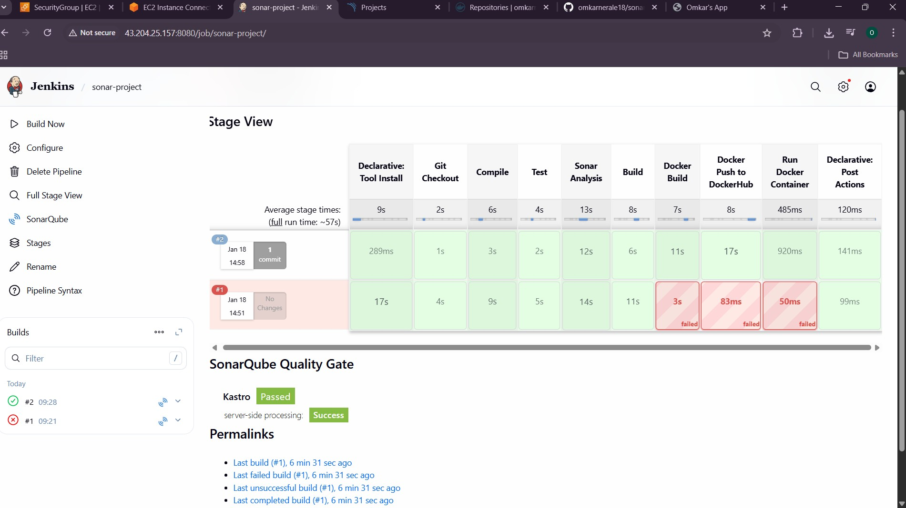
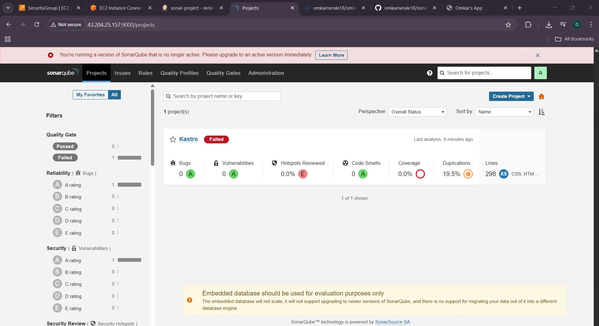
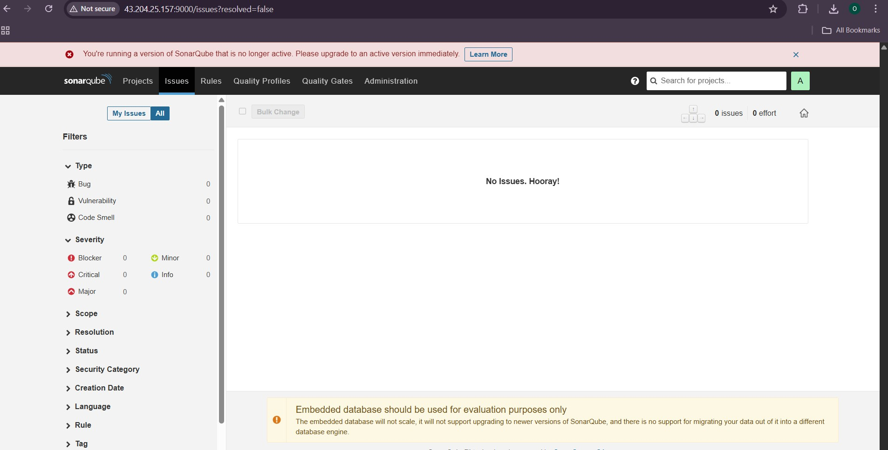
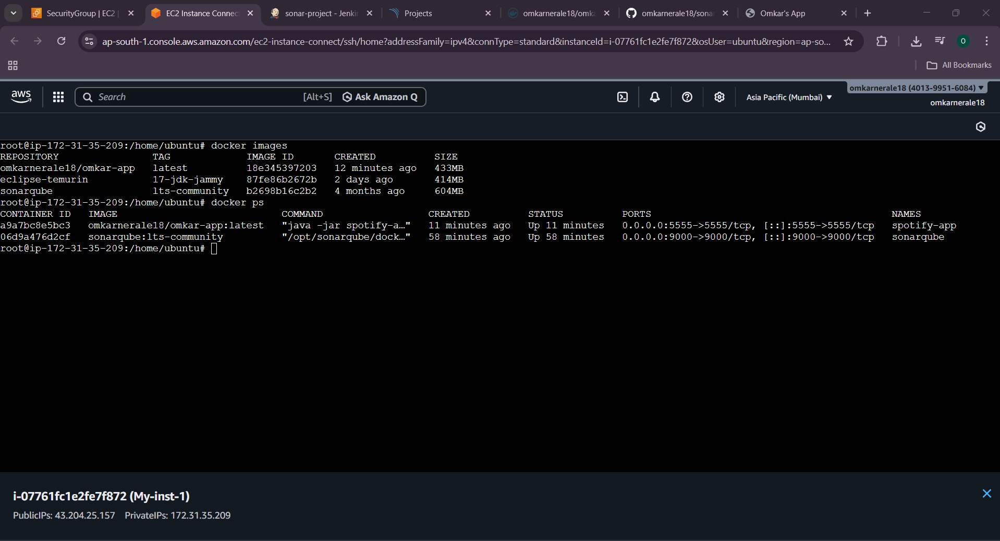
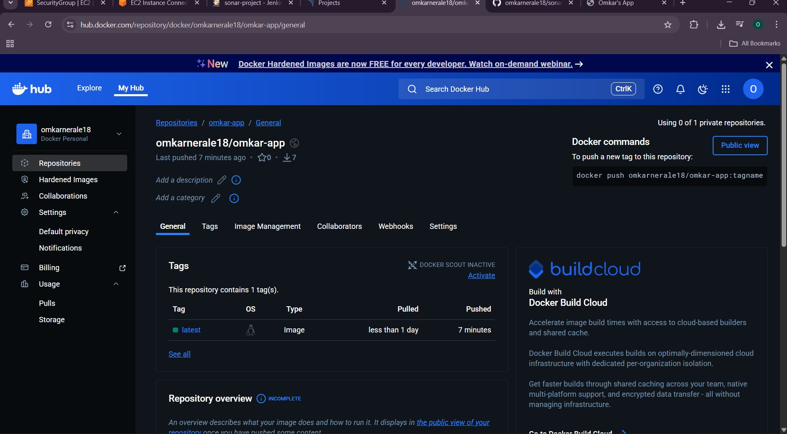
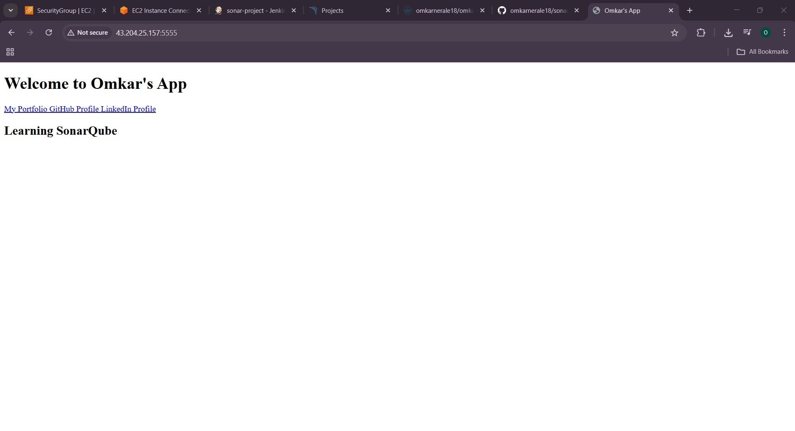

# SonarQube Code Quality Analysis Project

This project demonstrates **manual CI/CD pipeline execution for automated code quality analysis using SonarQube**.  
The goal is to analyze source code, detect bugs, vulnerabilities, and code smells, and generate quality reports through a Jenkins pipeline.

This repository is part of my DevOps learning journey and showcases integration of **SonarQube with Jenkins** for continuous code inspection.

---

## 🚀 Project Overview

In modern software development, maintaining clean and secure code is critical.  
This project implements a workflow where code is manually triggered in Jenkins to perform SonarQube analysis and generate quality reports.

---

## 🛠️ Tech Stack Used

- **Java / Spring Boot** – Sample application  
- **Maven** – Build tool  
- **SonarQube** – Code quality & security analysis  
- **Jenkins** – CI/CD automation  
- **Docker** – Containerization  
- **GitHub** – Source code management  

---

## ⚙️ Project Workflow

1. Developer pushes code to GitHub  
2. Jenkins pipeline is **manually triggered**  
3. Maven builds the project  
4. SonarQube scans the source code  
5. Quality Gate status is generated  
6. Reports are available on SonarQube Dashboard  

---

## 🔧 Jenkins Pipeline

The Jenkins pipeline is responsible for building the project and running the SonarQube analysis.  
Below is the pipeline used in this project:

```groovy

pipeline {
    agent any

    tools {
        maven 'maven3'
        jdk 'jdk23'
        // Remove the sonarQube line if it still causes issues
    }

    environment {
        SCANNER_HOME = tool 'sonar-scanner'
        DOCKERHUB_USERNAME = 'omkarnerale18'  // Set this directly to your Docker Hub username
        DOCKER_IMAGE = "${DOCKERHUB_USERNAME}/omkar-app:latest"
    }

    stages {
        stage('Git Checkout') {
            steps {
                git branch: 'main', url: 'https://github.com/omkarnerale18/sonarqube-project.git'
            }
        }

        stage('Compile') {
            steps {
                sh "mvn compile"
            }
        }

        stage('Test') {
            steps {
                sh "mvn test"
            }
        }

        stage('Sonar Analysis') {
            steps {
                withSonarQubeEnv('sonar-server') {
                    sh "$SCANNER_HOME/bin/sonar-scanner -Dsonar.projectName=omkar -Dsonar.projectKey=omkarKey -Dsonar.java.binaries=target"
                }
            }
        }

        stage('Build') {
            steps {
                sh "mvn package"
            }
        }

        stage('Docker Build') {
            steps {
                script {
                    // Building Docker Image
                    sh "docker build -t $DOCKER_IMAGE ."
                }
            }
        }

        stage('Docker Push to DockerHub') {
            steps {
                script {
                    withCredentials([usernamePassword(credentialsId: 'dockerhub-credentials', usernameVariable: 'DOCKERHUB_USERNAME', passwordVariable: 'DOCKERHUB_PASSWORD')]) {
                        echo "Docker Hub Username: ${DOCKERHUB_USERNAME}"  // Check the username
                        echo "Docker Image: ${DOCKER_IMAGE}"  // Check the image
                        sh "docker login -u ${DOCKERHUB_USERNAME} -p ${DOCKERHUB_PASSWORD}"
                        sh "docker push $DOCKER_IMAGE"
                    }
                }
            }
        }

        stage('Run Docker Container') {
            steps {
                script {
                    // Stop any existing container with the same name
                    sh "docker stop omkar-app || true && docker rm omkar-app || true"
                    
                    // Running the container
                    sh "docker run -d --name omkar-app -p 5555:5555 $DOCKER_IMAGE"
                }
            }
        }
    }

    post {
        always {
            echo 'Cleaning up workspace...'
            cleanWs()  // Clean up the workspace after the build
        }
    }
}
```
---

## 📊 SonarQube Analysis Focus Areas

- Bugs Detection  
- Vulnerability Scanning  
- Code Smells  
- Code Coverage  
- Maintainability Rating  
- Security Hotspots  

---
## 🖼️ Screenshots

### 🔹 1. Jenkins Pipeline Execution


### 🔹 2. SonarQube Project Dashboard



### 🔹 3. Docker Objects


### 🔹 4. DockerHub Image


### 🔹 5. My App Running


---
## 🎯 Learning outcomes
- Understood static code analysis concepts
- Integrated SonarQube with Jenkins
- Implemented automated quality checks
- Worked with Quality Gates
- Strengthened CI/CD pipeline skills

---

## 👤 Author
Omkar Nerale
(DevOps Engineer | CI/CD | Cloud | Automation)

